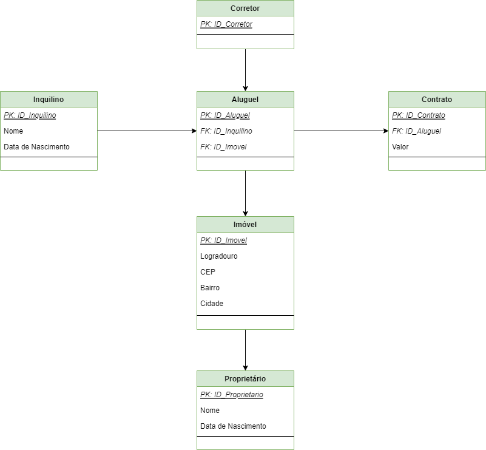
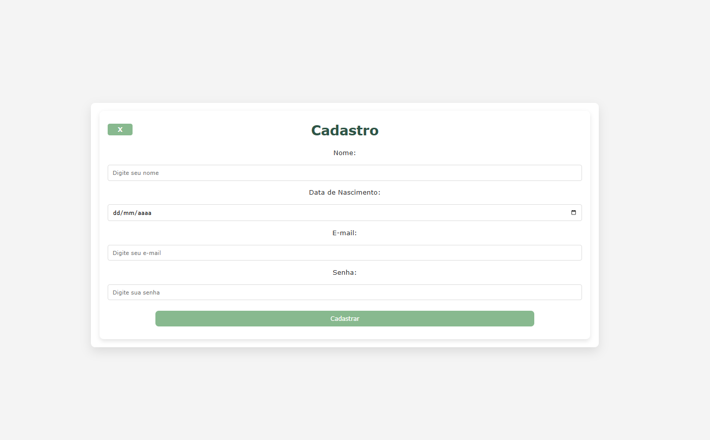

# Programa High Tech Talents
Exercícios feitos para obter a Capacitação em Python do programa High Tech Talents, promovido pela Share People Hub. O repositório reúne atividades práticas desenvolvidas durante o curso, abordando conceitos fundamentais de Python e resolução de problemas com programação.
 
## Listaagem de Exercícios

* [Lista 01](https://github.com/franciellerl/High-Tech-Talents-01/tree/main/%2301%20Estrutura%20Sequencial) (#01 Estrutura Sequencial)
  * Consiste nas 10 primeiras questões da [lista de Estrutura Sequencial](https://wiki.python.org.br/EstruturaSequencial) da PythonBrasil. Prazo: 21/03/2022.

* [Tabuada e Cadastro](https://github.com/franciellerl/High-Tech-Talents-01/tree/main/%2302%20Fun%C3%A7%C3%B5es) (#02 Funções)
  * Prazo: 31/03/2022.  

* [Herança de Meios de Transporte](https://github.com/franciellerl/High-Tech-Talents-01/tree/main/%2303%20Heran%C3%A7a) (#03 Herança)
  * Prazo: 07/04/2022.

* [Diagrama lógico e físico](https://github.com/franciellerl/High-Tech-Talents-01/tree/main/%2304%20Diagramas) (#04 Diagramas)
  * Prazo: 07/04/2022.

* [Tutorial de SQLAlchemy](https://github.com/franciellerl/High-Tech-Talents-01/tree/main/%2305%20SQLAlchemy) (#05 SQLAlchemy)
  * Prazo: 14/04/2022.

* [Projeto Final: versão para console](https://github.com/franciellerl/High-Tech-Talents-01/tree/main/%2306%20CRUD%20Console) (#06 CRUD Console)
  * Prazo: 26/04/2022.

* [Projeto Final: versão com flask](https://github.com/franciellerl/High-Tech-Talents-01/tree/main/%2307%20CRUD%20Flask) (#07 CRUD Flask)
  * Prazo: 26/04/2022. 

## Resultados
* 01
```python
#Faça um Programa que peça a temperatura em graus Celsius, transforme e mostre em graus Fahrenheit.
 celsius = float(input("Digite a temperatura em graus Celsius: "))
 fahrenheit = ((celsius * 9) / 5) + 32
 print("A temperatura em graus Fahrenheit é ", fahrenheit)

```
* 04


* 07


## Ferramentas Utilizadas

* Python
* CSS/HTML
* Flask
* SQLAlchemy
* Github

## Competências Demonstradas
Desenvolvimento de lógica de programação em Python, aplicação de conceitos de programação orientada a objetos, criação de aplicações web básicas com Flask, utilização de SQLAlchemy para integração com banco de dados e elaboração de diagramas para modelagem de sistemas.
